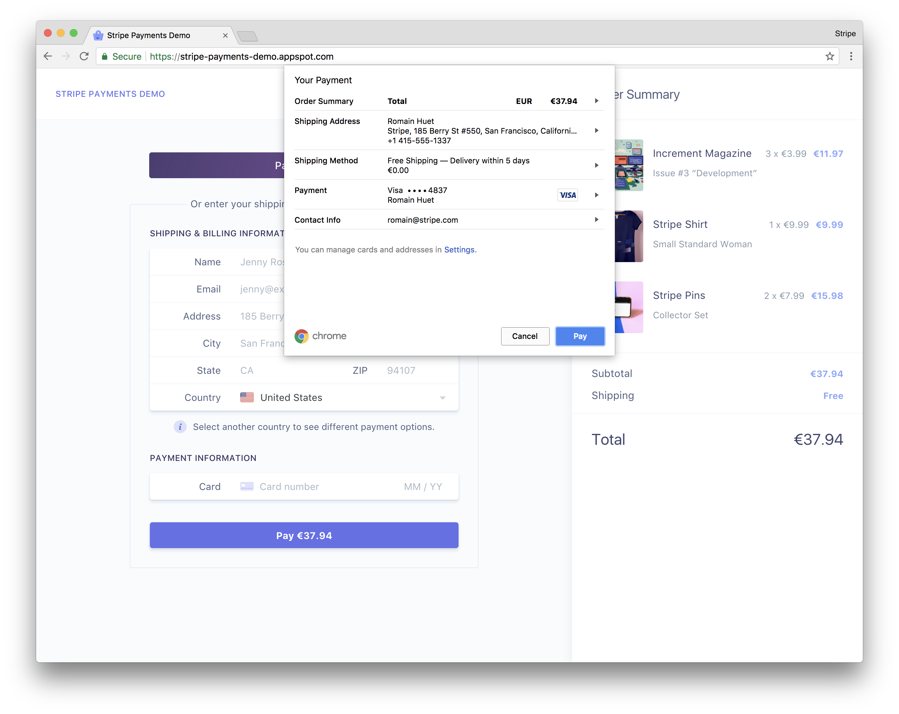
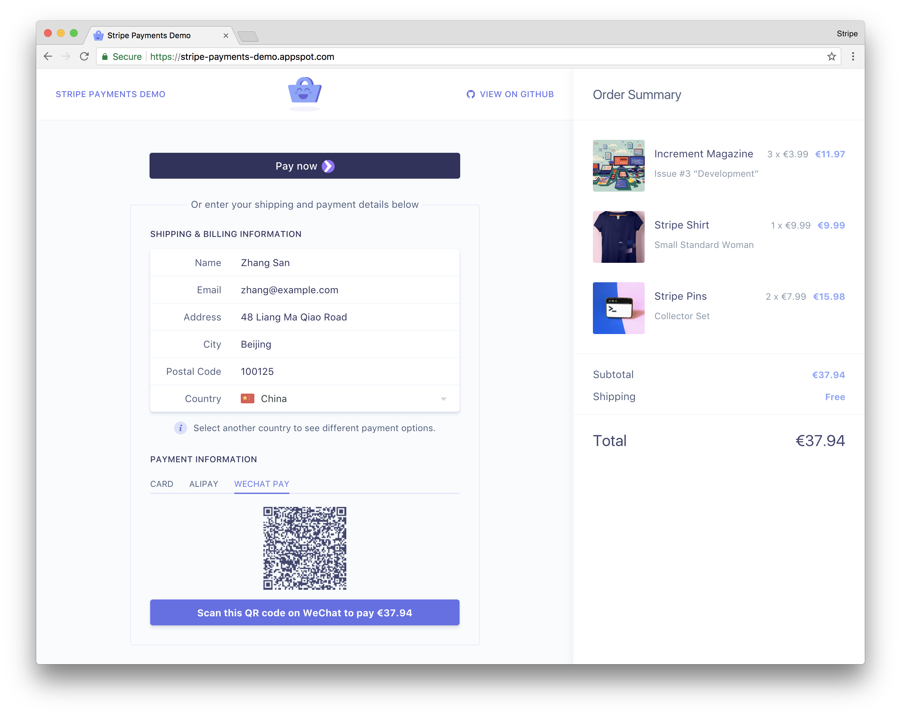

# Stripe Payments for Jingles

This app is based on Stripe Payments Demo and features social login with Facebook.
Readme file contains original sections from source repositories:

**you can see the dev version running on ngrok.** [Ngrok](https://softbytes.au.ngrok.io/)

1. Stripe Payment Demo
2. Facebook social login

Core of the app is based on Stripe Demo withh added social login.

# While reading original instructions from Stripe Demo consider changes made for Jingles app:
🔧 | **Inventory and setup**. We updated inventory with Jingles products and temp changed listProducts function to return static list of products. This needs to be reviewed and eventually lsit of product should come from index page selection

🔧 | **Checkout page**. We changed index page and checkout moved checkout.html

## Stripe Payments for Demo

This demo features a sample e-commerce store that uses [Stripe Elements](https://stripe.com/docs/elements), [PaymentIntents](https://stripe.com/docs/payments/payment-intents) for [dynamic authentication](https://stripe.com/docs/payments/3d-secure), and the [Sources API](https://stripe.com/docs/sources) to illustrate how to accept both card payments and additional payment methods on the web.

If you’re running a compatible browser, this demo also showcases the [Payment Request API](https://stripe.com/docs/payment-request-api), [Apple Pay](https://stripe.com/docs/apple-pay), [Google Pay](https://stripe.com/docs/google-pay), and [Microsoft Pay](https://stripe.com/docs/microsoft-pay) for a seamless payment experience.

**You can see this demo app running in test mode on [stripe-payments-demo.appspot.com](https://stripe-payments-demo.appspot.com).**

️⚠️ [️PaymentIntents](https://stripe.com/docs/payments/payment-intents) is the recommended integration path for 3D Secure authentication. It lets you benefit from [dynamic authentication](https://stripe.com/docs/payments/3d-secure) to maximize conversion and prepare for regulations like [Strong Customer Authentication](https://stripe.com/guides/strong-customer-authentication) in Europe.

## Overview

This demo provides an all-in-one example for integrating with Stripe on the web:

<!-- prettier-ignore -->
|     | Features
:---: | :---
✨ | **Beautiful UI components for card payments**. This demo uses pre-built Stripe components customized to fit the app design, including the [Card Element](https://stripe.com/docs/elements) which provides real-time validation, formatting, and autofill.
💳 | **Card payments with Payment Request, Apple Pay, Google Pay, and Microsoft Pay.** The app offers frictionless card payment experiences with a single integration using the [Payment Request Button Element](https://stripe.com/docs/elements/payment-request-button).
🌍 | **Payment methods for Europe and Asia.** A dozen redirect-based payment methods are supported through the [Sources API](https://stripe.com/docs/sources), from [iDEAL](https://stripe.com/docs/sources/ideal) to [WeChat Pay](https://stripe.com/docs/sources/wechat-pay).
🎩 | **Automatic payment methods suggestion.** Picking a country will automatically show relevant payment methods. For example, selecting  “Germany” will suggest SOFORT, Giropay, and SEPA Debit.
🔐 | **Dynamic 3D Secure for Visa and Mastercard.** The app automatically handles the correct flow to complete card payments with [3D Secure](https://stripe.com/docs/payments/dynamic-3ds), whether it’s required by the card or encoded in one of your [3D Secure Radar rules](https://dashboard.stripe.com/radar/rules).
📲 | **QR code generation for WeChat Pay.** During the payment process for [WeChat Pay](https://stripe.com/payments/payment-methods-guide#wechat-pay), a QR code is generated for the WeChat Pay URL to authorize the payment in the WeChat app.
🚀 | **Built-in proxy for local HTTPS and webhooks.** Card payments require HTTPS and asynchronous payment methods with redirects rely on webhooks to complete transactions—[ngrok](https://ngrok.com/) is integrated so the app is served locally over HTTPS. The [Stripe CLI](https://github.com/stripe/stripe-cli#listen) is used to forward webhook events to the local server.
🔧 | **Webhook signing**. We allow for [webhook signature verification](https://stripe.com/docs/webhooks/signatures), which is a recommended security practice.
📱 | **Responsive design**. The checkout experience works on all screen sizes. Apple Pay works on Safari for iPhone and iPad if the Wallet is enabled, and Payment Request works on Chrome for Android.
📦 | **No datastore required.** Products, and SKUs are stored using the [Stripe API](https://stripe.com/docs/api/products), which you can replace with your own database to keep track of products and inventory.

## Payments Integration

The frontend code for the demo is in the `public/` directory.

The core logic of the Stripe integration is mostly contained within two files:

1.  [`public/javascripts/payments.js`](public/javascripts/payments.js) creates the payment experience on the frontend using Stripe Elements.
2.  [`server/node/routes.js`](server/node/routes.js) defines the routes on the backend that create Stripe charges and receive webhook events.

### Card Payments with Stripe Elements

[Stripe Elements](https://stripe.com/docs/elements) let you quickly support cards, Apple Pay, Google Pay, and the new Payment Request API.

Stripe Elements are rich, pre-built UI components that create optimized checkout flows across desktop and mobile. Elements can accept any CSS property to perfectly match the look-and-feel of your app. They simplify the time-consuming parts when building payment forms, e.g. input validation, formatting, localization, and cross-browser support.

This demo uses both the [Card Element](https://stripe.com/docs/elements) and the [Payment Request Button](https://stripe.com/docs/elements/payment-request-button), which provides a single integration for Apple Pay, Google Pay, and the Payment Request API—a new browser standard that allows your customers to quickly provide payment and address information they’ve stored with their browser.

### Beyond Cards: Payment Methods for Europe and Asia

This demo also shows how to reach customers in Europe and Asia by supporting their preferred way to pay online. It supports payment methods such as [ACH credit transfers](https://stripe.com/payments/payment-methods-guide#ach-credit-transfers), [Alipay](https://stripe.com/payments/payment-methods-guide#alipay), [Bancontact](https://stripe.com/payments/payment-methods-guide#bancontact), [iDEAL](https://stripe.com/payments/payment-methods-guide#ideal), [Giropay](https://stripe.com/payments/payment-methods-guide#giropay), [SEPA Direct Debit](https://stripe.com/payments/payment-methods-guide#sepa), [SOFORT](https://stripe.com/payments/payment-methods-guide#sofort), and [WeChat Pay](https://stripe.com/payments/payment-methods-guide#wechat).

The app also supports both [Multibanco](https://stripe.com/docs/sources/multibanco) and [EPS](https://stripe.com/docs/sources/eps) which are currently in Public Beta on Stripe.

## Getting Started with Node

Instructions for running the Node.js server in [`server/node`](/server/node) are below. You can find alternative server implementations in the [`server`](/server) directory:

- Go, Echo: [`server/go`](/server/go)
- Java, Spark: [`server/java`](/server/java)
- Node, Express: [`server/node`](/server/node)
- PHP, Slim: [`server/php`](/server/php)
- Python, Flask: [`server/python`](/server/python)
- Ruby, Sinatra: [`server/ruby`](/server/ruby)

All servers have the same endpoints to handle requests from the frontend and interact with the [Stripe libraries](https://stripe.com/docs/libraries).

### Requirements

You’ll need the following:

- [Node.js](http://nodejs.org) >=10.0.0
- Modern browser that supports ES6 (Chrome to see the Payment Request, and Safari to see Apple Pay).
- Stripe account to accept payments ([sign up](https://dashboard.stripe.com/register) for free).

In your Stripe Dashboard, you can [enable the payment methods](https://dashboard.stripe.com/payments/settings) you’d like to test.

Some payment methods require receiving a real-time webhook notification to complete a charge. We're using the [Stripe CLI](https://github.com/stripe/stripe-cli#listen) to forward webhook events to our local development server. Additionally this demo is bundled with [ngrok](https://ngrok.com/), to serve the app locally via HTTPS, which is required for the Payment Request API.

### Running the Node Server

Copy the environment variables file from the root of the repository:

    cp .env.example .env

Update `.env` with your own [Stripe API keys](https://dashboard.stripe.com/account/apikeys) and any other configuration details. These environment variables are loaded and used in [`server/node/config.js`](/server/node/config.js), where you can review and edit other options such as the app currency and your Stripe account country.

Install dependencies using npm:

    npm install

This demo uses the Stripe API as a datastore for products and SKUs, but you can always choose to use your own datastore instead. After `npm install` has finished the `setup` script will run to create the product records on your Stripe account.

Next, follow [these installation steps](https://github.com/stripe/stripe-cli#installation) to install the Stripe CLI which we'll use for webhook testing.

After the installation has finished, authenticate the CLI with your Stripe account:

    stripe login --project-name=stripe-payments-demo

To start the webhook forwarding run:

    stripe listen --project-name=stripe-payments-demo --forward-to http://localhost:8000/webhook

Alternatively, you can use the following shorthand command:

    npm run webhook

The Stripe CLI will let you know that webhook forwarding is ready and output your webhook signing secret:

    > Ready! Your webhook signing secret is whsec_xxx

Please copy the webhook signing secret (`whsec_xxx`) to your `.env` file.

In a separate terminal window, start the local server:

    npm run start

Lastly, you will see the ngrok URL to serve our app via HTTPS. For example:

    https://<example>.ngrok.io

Use this URL in your browser to start the demo.

## Credits

- Code: [Romain Huet](https://twitter.com/romainhuet) and [Thorsten Schaeff](https://twitter.com/thorwebdev)
- Design: [Tatiana Van Campenhout](https://twitter.com/tatsvc)
